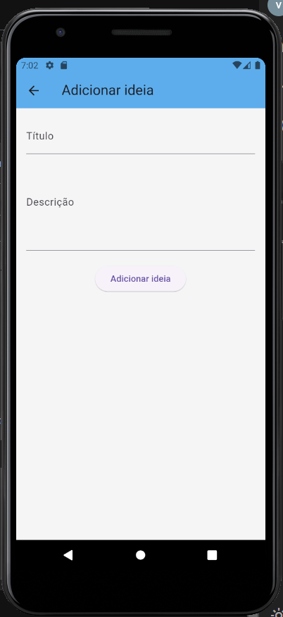

# Creative Ideas

Um projeto flutter desenvolvido por Vinicius Fernandes Carvalho, aluno do 4° semestre de engenharia de software da Católica SC.

O projeto Creative Ideas é um aplicativo de gerenciamento de ideias criativas, sendo um CRUD básico, podendo criar/adicionar, editar, excluir e atualizar as ideias do usuário, seguindo a premissa feita para a N2 da matéria de desenvolvimento mobile.

## Escopo
App de Gerenciamento de ideias criativas
Objetivo: O usuário pode visualizar, registrar, editar, excluir e atualizar suas ideias.

## Telas do projeto

| Listagem de ideias vazia | Listagem de ideias |
|--------------|-----------------------|
|  |  |

| Atualização de ideias | Adicionar ideias |
|--------------------------|----------------------------|
|  |  |

| Exclusão de ideias |
|--------------------------|
|  |

## Como importar o projeto

1. Clone o repositório:
   git clone https://github.com/usuario/repositorio.git

2. Navegue até a pasta do projeto:
   cd repositorio

3. Instale as dependências:
   flutter pub get

4. Execute o projeto:
   flutter run

### Requisitos:
Flutter SDK instalado

Um dispositivo Android/iOS ou emulador configurado
